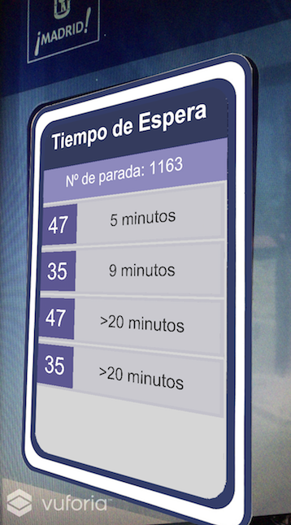

# madridbusstop
Augmented Reality app for Madrid EMT buses. This app shows an AR panel with the bus arrivals information of the recognized bus stop. Not published due to the need of pay the Vuforia license.

******************************

Vuforia on itself doesn't provide any system to detect numbers, just letters. To solve this problem I thought on the next strategy:
  1. Recognize the image
  2. Capture a Screenshot just after the target image is recognized (this screenshot must contain the number)
  3. Send the Screenshot to an OCR service and get the response
  4. Extract the number from the response
  5. Use this number to do whatever you need and show AR info
  
This approach solves this problem, but it doesn't work like a charm. Their success depends on the quality of the screenshot and the OCR service.

*******************************

To give you an example of utilization of this strategy I developed this simple app for the Madrid bus stops.

To make it run you must do the steps as follow:
  1. Open the project with Unity
  2. Add your Vuforia App license key into the Vuforia configuration of the ARCamera GameObject
  3. Modify the ArrivalsPanelController.cs of the Scripts folder
    * In the getTextFromImage() function, add your API key for the OCR web service (you can ask for one here: https://ocr.space/ocrapi)
    * In the getStopInfo() function, add your credentials for the EMT bus arrivals web service (you can ask for them here: http://opendata.emtmadrid.es/Formulario)
  5. Revise all prefabs dependencies contained in the Prefabs folder
  6. Run
  
It was developed on a Macbook Pro with Unity 5.4.2f2 and it was tested on Iphone 7 with iOS v10.3

